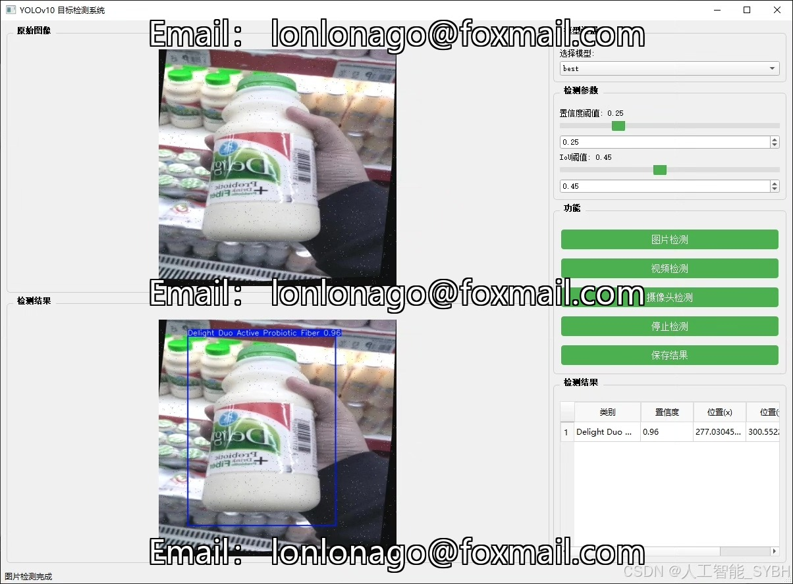
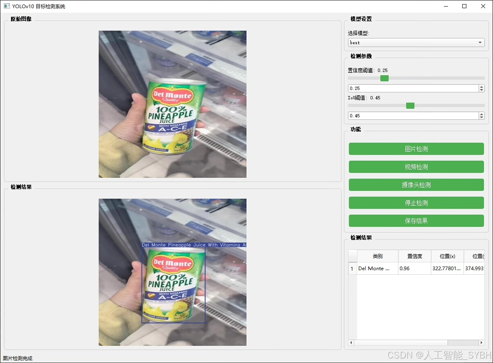
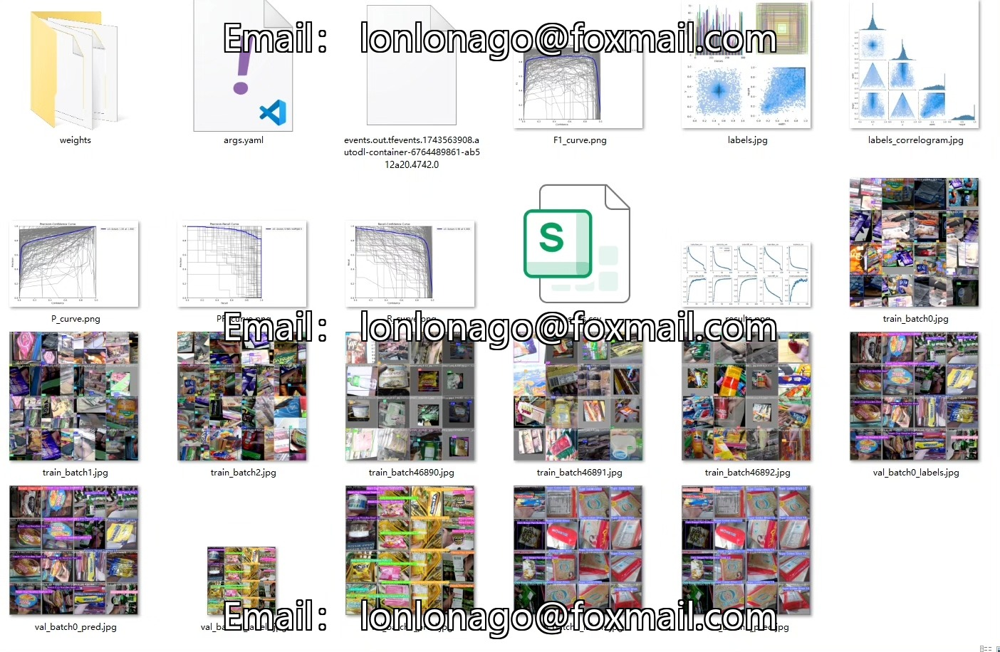
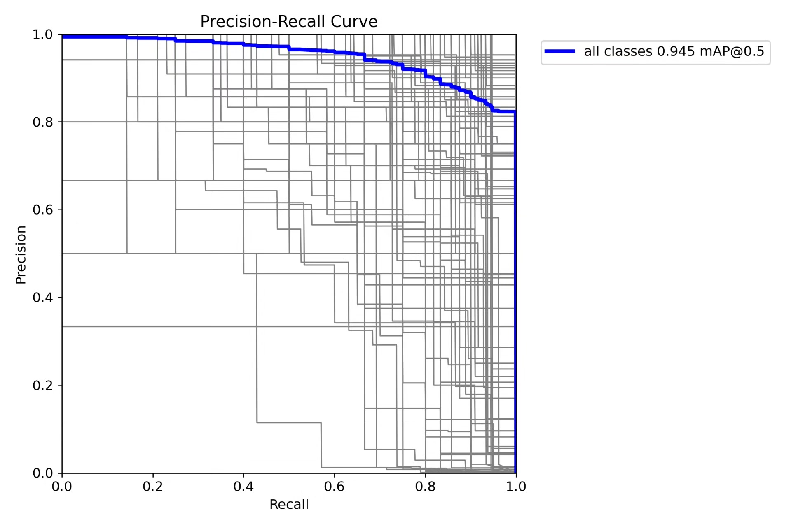
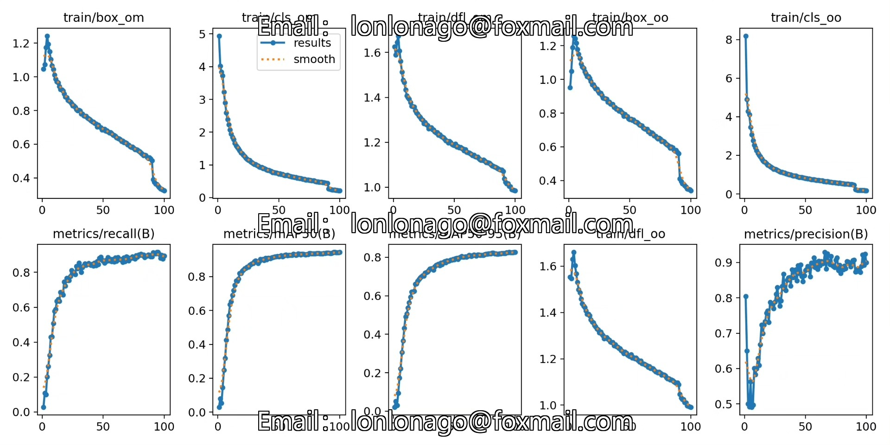
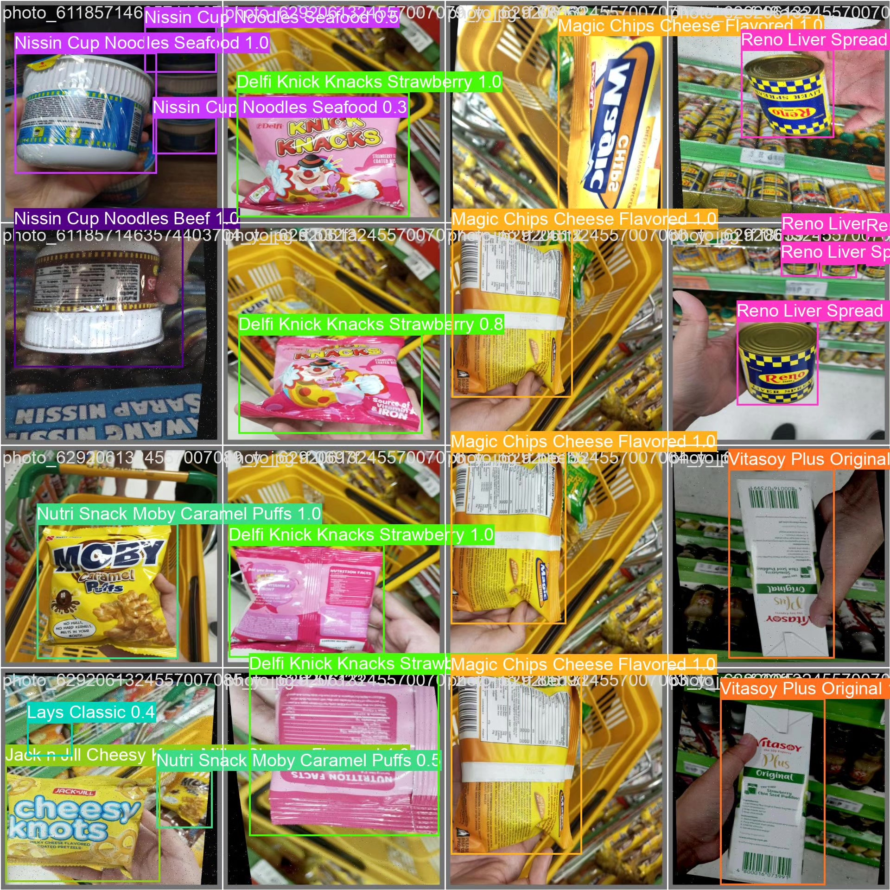
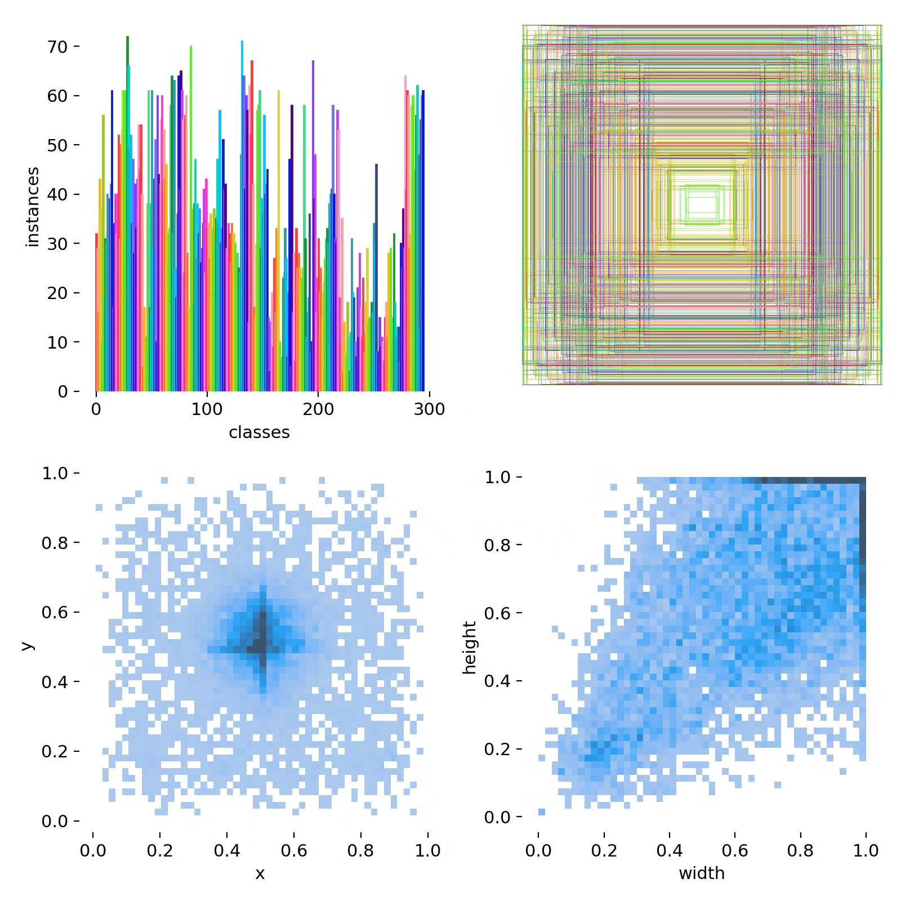
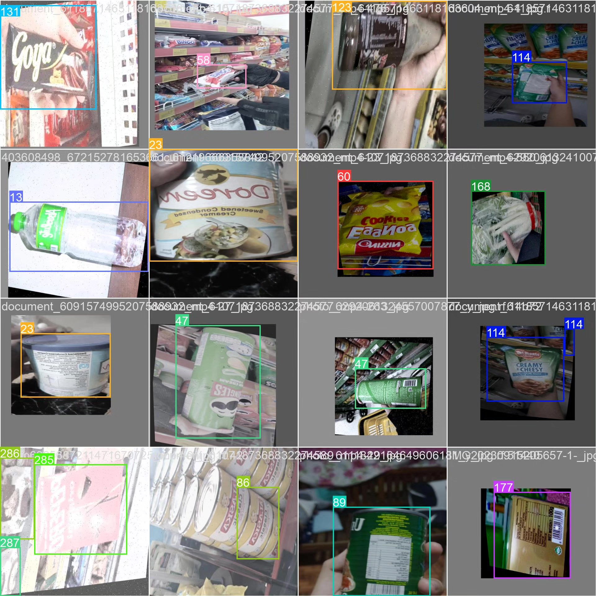

# Based on deep learning YOLOv10 for supermarket product detection system (YOLOv10)

## Body

This project has developed a smart recognition system for supermarket products based on the YOLOv10 object detection algorithm, aiming to achieve automated recognition and classification of various supermarket products in the environment. The system can accurately recognize 295 different types of supermarket products, including beverages, snacks, condiments, canned food, dairy products, and more. The project uses a dataset containing 10,499 images (8,336 training images and 2,163 validation images) for model training, covering common product arrangements, lighting conditions, and occlusions in supermarket environments. This system can be applied to various scenarios such as supermarket intelligent checkout, inventory management, and shelf monitoring, significantly improving the operational efficiency and service quality of the retail industry.

The company's products have obtained the YOLO official commercial license certification.

We provide after-sales service.

After payment, we will provide WeChat IDs for instant questions and answers.

Environment configuration: We will provide an instructional tutorial on how to set up the environment, with WeChat providing Q&A services.

Remote installation service: If you need remote configuration, an additional fee of 69 is required.
If the configuration fails, all fees will be refunded (only the installation fee is refundable for older computers).

Retraining the dataset: After setting up the environment, you can train on your own computer.
If you need us to retrain, just pay 69 plus the computing power fee (2.5 yuan/hour).

Full after-sales service

## Images

## Payment

Here is a pay link on Stripe ( https://buy.stripe.com/3cs8yP7sY87d0vu9AB ). Please contact me lonlonago@foxmail.com after funding $89, and I will send you a complete data files , thank you!

